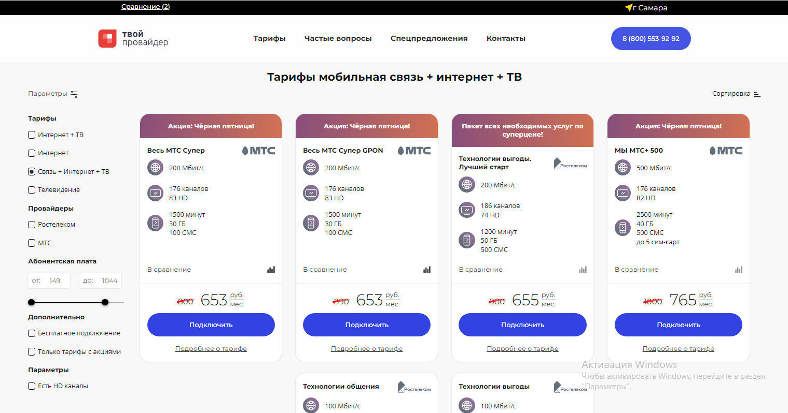

__Клон сайта по предоставлению услуг связи от интернет провайдеров__ - [Demo](https://sergeibesunov.github.io/tvoi-provider/)

Интерфейс разработан на ReactJS, для тестирования работы с бэкендом на сайте render.com через web-service развернут json-server с данными, куда и поступают GET запросы. В общей сложности данные делятся на (города, адреса, тарифы). 
Для теста добавлены 3 города: Новосибирск, Казань, Самара.
И порядка 80-ти разных тарифных плана, для возможности задействовать все параметры фильтрации.
Запрос по адресам и тарифам зависит от выбранного города.

__Stack:__

- ReactJS
- Redux Toolkit 
- React Router version 6
- JSON Server

 
